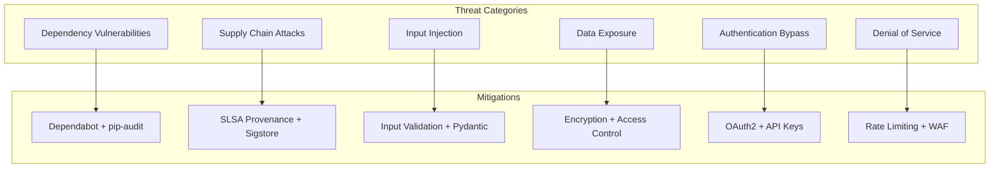

# Security and Supply Chain

This document provides comprehensive documentation for UCID's security practices, supply chain integrity, vulnerability management, and security compliance.

---

## Table of Contents

1. [Overview](#overview)
2. [Security Model](#security-model)
3. [Threat Analysis](#threat-analysis)
4. [Authentication and Authorization](#authentication-and-authorization)
5. [Data Protection](#data-protection)
6. [Dependency Management](#dependency-management)
7. [SBOM](#sbom)
8. [SLSA Provenance](#slsa-provenance)
9. [Vulnerability Management](#vulnerability-management)
10. [Security Testing](#security-testing)
11. [Incident Response](#incident-response)
12. [Compliance](#compliance)
13. [Best Practices](#best-practices)

---

## Overview

UCID follows industry best practices for security and supply chain integrity, including SLSA Level 3 compliance, comprehensive dependency scanning, and secure development lifecycle practices.

### Security Certifications

| Certification | Status | Level | Verification |
|---------------|--------|-------|--------------|
| SLSA | Verified | Level 3 | Sigstore |
| OpenSSF Scorecard | A | 8.5/10 | GitHub |
| CII Best Practices | Passing | Silver | Linux Foundation |
| SOC 2 Type II | In Progress | N/A | Auditor |

### Security Principles

| Principle | Implementation |
|-----------|----------------|
| **Defense in depth** | Multiple security layers |
| **Least privilege** | Minimal required permissions |
| **Secure defaults** | Security enabled by default |
| **Fail securely** | Errors don't expose data |
| **Zero trust** | Verify all access |

---

## Security Model

### Threat Model



### Security Controls

| Control | Implementation | Tool/Framework |
|---------|----------------|----------------|
| Input Validation | Schema validation | Pydantic |
| Authentication | API keys, OAuth2 | FastAPI Security |
| Authorization | Role-based access | Custom middleware |
| Encryption | TLS 1.3, AES-256 | cryptography |
| Dependency Scanning | Automated scanning | Dependabot, pip-audit |
| Static Analysis | Security-focused linting | Bandit, CodeQL |
| Secret Detection | Pre-commit scanning | detect-secrets |
| Signed Releases | Cryptographic signatures | GPG, Sigstore |
| Audit Logging | Comprehensive logs | structlog |

---

## Threat Analysis

### STRIDE Analysis

| Threat | Category | Risk | Mitigation |
|--------|----------|------|------------|
| Spoofed API requests | Spoofing | High | API key + rate limiting |
| Modified transit data | Tampering | Medium | Data validation |
| Denial of service | DoS | High | Rate limiting, CDN |
| Exposed credentials | Info Disclosure | Critical | Secret scanning |
| Privilege escalation | Elevation | High | RBAC, least privilege |
| Repudiation of actions | Repudiation | Medium | Audit logging |

### Risk Matrix

| Impact / Likelihood | Low | Medium | High |
|---------------------|-----|--------|------|
| **High** | Medium | High | Critical |
| **Medium** | Low | Medium | High |
| **Low** | Informational | Low | Medium |

---

## Authentication and Authorization

### API Authentication

```python
from fastapi import Security, HTTPException, Depends
from fastapi.security import APIKeyHeader, OAuth2PasswordBearer

api_key_header = APIKeyHeader(name="X-API-Key")
oauth2_scheme = OAuth2PasswordBearer(tokenUrl="token")

async def verify_api_key(api_key: str = Security(api_key_header)) -> str:
    """Verify API key is valid."""
    if not await is_valid_api_key(api_key):
        raise HTTPException(
            status_code=403,
            detail="Invalid or expired API key",
        )
    return api_key

async def get_current_user(token: str = Depends(oauth2_scheme)) -> User:
    """Get current user from OAuth2 token."""
    try:
        payload = jwt.decode(token, SECRET_KEY, algorithms=["HS256"])
        user = await get_user(payload["sub"])
        if user is None:
            raise HTTPException(status_code=401, detail="User not found")
        return user
    except jwt.JWTError:
        raise HTTPException(status_code=401, detail="Invalid token")
```

### Role-Based Access Control

| Role | Permissions | Rate Limit |
|------|-------------|------------|
| Anonymous | Public endpoints only | 100/day |
| Free | Basic UCID operations | 1000/day |
| Developer | All contexts, batch | 10000/day |
| Admin | Full access, management | Unlimited |

---

## Data Protection

### Encryption Standards

| Data State | Encryption | Algorithm |
|------------|------------|-----------|
| In transit | TLS 1.3 | ECDHE + AES-256-GCM |
| At rest | AES-256 | AES-256-CBC |
| API keys | Hashed | Argon2id |
| Passwords | Hashed | Argon2id |

### Data Classification

| Classification | Examples | Handling |
|----------------|----------|----------|
| Public | Context definitions | No restrictions |
| Internal | Aggregate scores | Authentication required |
| Confidential | User data | Encryption required |
| Restricted | API keys | Encrypted + access log |

### PII Handling

```python
from pydantic import BaseModel, Field
from typing import Annotated

class UserRequest(BaseModel):
    """User request with PII handling."""
    lat: Annotated[float, Field(ge=-90, le=90)]
    lon: Annotated[float, Field(ge=-180, le=180)]
    
    def anonymize(self) -> dict:
        """Return anonymized version for logging."""
        return {
            'lat': round(self.lat, 2),  # Reduce precision
            'lon': round(self.lon, 2),
        }
```

---

## Dependency Management

### Dependency Policy

| Criterion | Requirement | Enforcement |
|----------|-------------|-------------|
| License | OSI-approved | CI check |
| Maintenance | Active (< 6 months) | Manual review |
| Security | No critical CVEs | pip-audit |
| Reputation | > 1000 downloads/week | Manual review |
| Direct deps | Minimize count | Architectural review |

### Dependency Pinning

```toml
# pyproject.toml - pinned dependencies
[project]
dependencies = [
    "numpy>=1.26.0,<2.0.0",
    "pandas>=2.1.0,<3.0.0",
    "h3>=3.7.6,<4.0.0",
    "pydantic>=2.5.0,<3.0.0",
]

[project.optional-dependencies]
dev = [
    "pytest>=8.0.0,<9.0.0",
    "pytest-cov>=4.1.0,<5.0.0",
    "mypy>=1.9.0,<2.0.0",
]
```

### Automated Scanning

```bash
# Audit for vulnerabilities
pip-audit --strict --progress-spinner=off

# Check licenses
pip-licenses --fail-on "GPL;LGPL"

# Update dependencies
pip-compile --upgrade requirements.in
```

### Dependabot Configuration

```yaml
# .github/dependabot.yml
version: 2
updates:
  - package-ecosystem: "pip"
    directory: "/"
    schedule:
      interval: "weekly"
    reviewers:
      - "security-team"
    labels:
      - "dependencies"
      - "security"
    open-pull-requests-limit: 10
```

---

## SBOM

### Software Bill of Materials

UCID generates SBOM in CycloneDX format for every release:

```bash
# Generate SBOM
cyclonedx-py requirements requirements.txt -o sbom.json

# Generate from pip
cyclonedx-py environment -o sbom-installed.json
```

### SBOM Contents

| Component | Version | License | Source |
|-----------|---------|---------|--------|
| numpy | 1.26.4 | BSD-3-Clause | PyPI |
| pandas | 2.2.0 | BSD-3-Clause | PyPI |
| h3 | 3.7.6 | Apache-2.0 | PyPI |
| pydantic | 2.6.0 | MIT | PyPI |
| geopandas | 0.14.3 | BSD-3-Clause | PyPI |
| shapely | 2.0.2 | BSD-3-Clause | PyPI |

### SBOM Validation

```python
def validate_sbom(sbom_path: str) -> dict:
    """Validate SBOM completeness and accuracy."""
    import json
    
    with open(sbom_path) as f:
        sbom = json.load(f)
    
    issues = []
    
    for component in sbom.get('components', []):
        # Check for required fields
        if not component.get('name'):
            issues.append("Missing component name")
        if not component.get('version'):
            issues.append(f"Missing version for {component.get('name')}")
        if not component.get('licenses'):
            issues.append(f"Missing license for {component.get('name')}")
    
    return {
        'valid': len(issues) == 0,
        'issues': issues,
        'component_count': len(sbom.get('components', [])),
    }
```

---

## SLSA Provenance

### SLSA Compliance

UCID releases include SLSA Level 3 provenance attestations:

| SLSA Requirement | Implementation |
|------------------|----------------|
| Source versioned | Git |
| Build scripted | GitHub Actions |
| Build isolated | GitHub-hosted runners |
| Provenance generated | slsa-github-generator |

### Provenance Attestation

```json
{
  "_type": "https://in-toto.io/Statement/v0.1",
  "predicateType": "https://slsa.dev/provenance/v1",
  "subject": [
    {
      "name": "ucid-1.0.0.tar.gz",
      "digest": {
        "sha256": "abc123def456..."
      }
    }
  ],
  "predicate": {
    "buildType": "https://github.com/slsa-framework/slsa-github-generator/...",
    "builder": {
      "id": "https://github.com/slsa-framework/slsa-github-generator/.github/workflows/..."
    },
    "invocation": {
      "configSource": {
        "uri": "git+https://github.com/ucid-foundation/ucid@refs/tags/v1.0.0"
      }
    }
  }
}
```

### Verification

```bash
# Install verifier
go install github.com/slsa-framework/slsa-verifier/v2/cli/slsa-verifier@latest

# Verify provenance
slsa-verifier verify-artifact \
  ucid-1.0.0.tar.gz \
  --provenance-path ucid-1.0.0.intoto.jsonl \
  --source-uri github.com/ucid-foundation/ucid \
  --source-tag v1.0.0
```

---

## Vulnerability Management

### Response Timeline

| Severity | Discovery to Triage | Triage to Fix | Fix to Release |
|----------|---------------------|---------------|----------------|
| Critical | 4 hours | 24 hours | 48 hours |
| High | 24 hours | 72 hours | 1 week |
| Medium | 1 week | 2 weeks | 1 month |
| Low | 2 weeks | 1 month | Next release |

### Reporting Process

```
Report → security@ucid.org
    ↓
Acknowledge (24h)
    ↓
Triage & Assess
    ↓
Develop Fix
    ↓
Coordinate Disclosure
    ↓
Release & Announce
```

### Security Advisory Template

```markdown
# Security Advisory

## Summary
Brief description of the vulnerability.

## Severity
CVSS Score: X.X (Severity)

## Affected Versions
- ucid >= 1.0.0, < 1.2.3

## Patched Versions
- ucid >= 1.2.3

## Workarounds
Steps to mitigate if upgrade not immediately possible.

## References
- CVE-XXXX-XXXXX
- GitHub Security Advisory
```

---

## Security Testing

### Automated Security Testing

| Tool | Purpose | Frequency |
|------|---------|-----------|
| Bandit | Python security linting | Every commit |
| pip-audit | Dependency vulnerabilities | Daily |
| CodeQL | Deep code analysis | Every PR |
| Trivy | Container scanning | Every build |
| OWASP ZAP | Dynamic testing | Weekly |

### Penetration Testing

Annual penetration testing by certified third party.

---

## Best Practices

### Developer Guidelines

| Practice | Rationale |
|----------|-----------|
| Pin all dependencies | Reproducible builds |
| Run security scans locally | Catch issues early |
| Sign commits with GPG | Verify authorship |
| Review dependency updates | Understand changes |
| Report vulnerabilities | Responsible disclosure |

---

Copyright 2026 UCID Foundation. All rights reserved.
