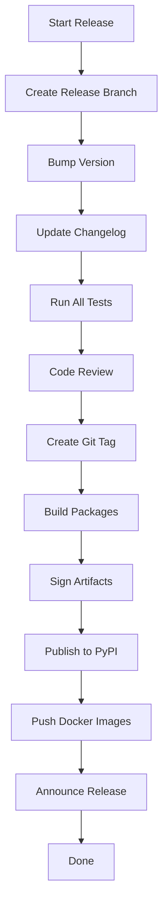
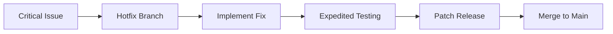

# Release Process

This document provides comprehensive documentation for UCID's release management, versioning strategy, and publication procedures.

---

## Table of Contents

1. [Overview](#overview)
2. [Version Scheme](#version-scheme)
3. [Release Types](#release-types)
4. [Release Schedule](#release-schedule)
5. [Release Workflow](#release-workflow)
6. [Pre-Release Testing](#pre-release-testing)
7. [Changelog Management](#changelog-management)
8. [Publishing](#publishing)
9. [Docker Images](#docker-images)
10. [Post-Release Verification](#post-release-verification)
11. [Hotfix Process](#hotfix-process)
12. [Communication](#communication)
13. [Best Practices](#best-practices)

---

## Overview

UCID follows Semantic Versioning 2.0.0 and maintains a regular release schedule with automated CI/CD pipelines for publishing.

### Release Philosophy

| Principle | Implementation |
|-----------|----------------|
| Predictable schedule | Monthly minor releases |
| Backward compatibility | Deprecation before removal |
| Quality gates | All tests must pass |
| Signed releases | GPG + Sigstore |
| Automated publishing | GitHub Actions |

### Release Schedule

| Release Type | Frequency | Content |
|--------------|-----------|---------|
| Major | 12-18 months | Breaking changes |
| Minor | 6-8 weeks | New features, improvements |
| Patch | As needed | Bug fixes, security |
| Pre-release | Before major/minor | Testing builds |

---

## Version Scheme

### Semantic Versioning

```
MAJOR.MINOR.PATCH[-PRERELEASE][+BUILD]

Examples:
  1.0.0          - Stable release
  1.1.0          - Feature release
  1.1.1          - Patch release
  2.0.0-alpha.1  - Alpha prerelease
  2.0.0-beta.1   - Beta prerelease
  2.0.0-rc.1     - Release candidate
```

### Version Components

| Component | Trigger | Example |
|-----------|---------|---------|
| MAJOR | Breaking API changes | 1.0.0 → 2.0.0 |
| MINOR | New backward-compatible features | 1.0.0 → 1.1.0 |
| PATCH | Backward-compatible bug fixes | 1.0.0 → 1.0.1 |
| Pre-release | Development versions | 2.0.0-alpha.1 |
| Build | Metadata (not for PyPI) | 1.0.0+build.123 |

### Breaking Change Definition

| Change Type | Breaking? | Example |
|-------------|-----------|---------|
| Remove public function | Yes | Remove `create_ucid_v1()` |
| Change function signature | Yes | Add required parameter |
| Change return type | Yes | Return dict instead of UCID |
| Add optional parameter | No | Add `timeout=None` |
| Add new function | No | Add `validate_ucid()` |
| Change internal API | No | Refactor private module |

---

## Release Types

### Major Releases

Major releases introduce breaking changes and require migration:

- Comprehensive migration guide
- Deprecation in previous version
- Extended support for N-1 version
- Major announcement

### Minor Releases

Minor releases add features without breaking changes:

- New context algorithms
- Performance improvements
- New export formats
- API additions

### Patch Releases

Patch releases fix bugs and security issues:

- Bug fixes
- Security patches
- Documentation corrections
- Dependency updates (security)

### Pre-Releases

Pre-releases allow testing before stable release:

| Stage | Stability | Purpose |
|-------|-----------|---------|
| alpha | Unstable | Feature preview |
| beta | Semi-stable | Testing |
| rc | Stable | Final validation |

---

## Release Workflow

### Process Overview



### Detailed Steps

1. **Create Release Branch**
   ```bash
   git checkout main
   git pull origin main
   git checkout -b release/v1.2.0
   ```

2. **Bump Version**
   ```bash
   # Using bumpversion
   bumpversion minor
   
   # Or manually update pyproject.toml
   # version = "1.2.0"
   ```

3. **Update Changelog**
   ```bash
   # Add release notes to CHANGELOG.md
   # Follow Keep a Changelog format
   ```

4. **Run Tests**
   ```bash
   pytest --cov
   mypy src/ucid
   ruff check src/
   ```

5. **Create Tag**
   ```bash
   git tag -s v1.2.0 -m "Release v1.2.0"
   git push origin v1.2.0
   ```

### Release Checklist

- [ ] All tests pass on CI
- [ ] Changelog updated with all changes
- [ ] Version bumped in pyproject.toml
- [ ] Documentation updated
- [ ] Migration guide (if breaking changes)
- [ ] Release notes drafted
- [ ] Tag created and pushed
- [ ] Package built successfully
- [ ] Package published to PyPI
- [ ] Docker images pushed
- [ ] GitHub Release created
- [ ] Announcement posted

---

## Pre-Release Testing

### Test Matrix

| Environment | Python | OS | Priority |
|-------------|--------|----|----------|
| CI | 3.11, 3.12 | Ubuntu | Required |
| CI | 3.12 | Windows | Required |
| CI | 3.12 | macOS | Required |
| Manual | 3.11 | Local | Recommended |

### Release Candidate Testing

```bash
# Install release candidate
pip install ucid==2.0.0rc1

# Run integration tests
pytest tests/integration/

# Test CLI
ucid --version
ucid score IST 41.015 28.979

# Test API
uvicorn ucid.api.app:app --port 8000
curl http://localhost:8000/health
```

---

## Changelog Management

### Format

Following [Keep a Changelog](https://keepachangelog.com/):

```markdown
# Changelog

## [Unreleased]

### Added
- New feature description

### Changed
- Change description

### Deprecated
- Deprecation notice

### Removed
- Removal description

### Fixed
- Bug fix description

### Security
- Security fix description

## [1.2.0] - 2026-01-15

### Added
- New 15MIN context algorithm with improved accuracy
- Support for GeoPackage export format
```

### Automation

```python
# scripts/update_changelog.py
def add_changelog_entry(version: str, category: str, message: str):
    """Add entry to changelog."""
    changelog = Path("CHANGELOG.md").read_text()
    
    # Find Unreleased section and add entry
    pattern = r"(## \[Unreleased\].*?)(### " + category + r"\n)"
    replacement = f"\\1\\2- {message}\n"
    
    updated = re.sub(pattern, replacement, changelog, flags=re.DOTALL)
    Path("CHANGELOG.md").write_text(updated)
```

---

## Publishing

### PyPI Publication

```yaml
# .github/workflows/release.yml
name: Release

on:
  release:
    types: [published]

jobs:
  publish-pypi:
    runs-on: ubuntu-latest
    environment: release
    permissions:
      id-token: write
    
    steps:
      - uses: actions/checkout@v4
      
      - name: Set up Python
        uses: actions/setup-python@v5
        with:
          python-version: "3.12"
      
      - name: Install build tools
        run: pip install build twine
      
      - name: Build package
        run: python -m build
      
      - name: Check package
        run: twine check dist/*
      
      - name: Publish to PyPI
        uses: pypa/gh-action-pypi-publish@release/v1
```

### Build Verification

```bash
# Verify package contents
tar -tzf dist/ucid-1.2.0.tar.gz

# Verify wheel
unzip -l dist/ucid-1.2.0-py3-none-any.whl

# Test installation in fresh environment
python -m venv test_env
source test_env/bin/activate
pip install dist/ucid-1.2.0-py3-none-any.whl
python -c "import ucid; print(ucid.__version__)"
```

---

## Docker Images

### Multi-Architecture Build

```yaml
# .github/workflows/docker.yml
- name: Build and push
  uses: docker/build-push-action@v5
  with:
    context: .
    platforms: linux/amd64,linux/arm64
    push: true
    tags: |
      ghcr.io/ucid-foundation/ucid:${{ github.ref_name }}
      ghcr.io/ucid-foundation/ucid:latest
```

### Image Tags

| Tag | Description |
|-----|-------------|
| latest | Latest stable release |
| 1.2.0 | Specific version |
| 1.2 | Latest 1.2.x |
| 1 | Latest 1.x.x |
| main | Development build |

---

## Post-Release Verification

### Verification Steps

1. **PyPI Installation**
   ```bash
   pip install ucid==1.2.0
   python -c "import ucid; print(ucid.__version__)"
   ```

2. **Docker Pull**
   ```bash
   docker pull ghcr.io/ucid-foundation/ucid:1.2.0
   docker run ghcr.io/ucid-foundation/ucid:1.2.0 ucid --version
   ```

3. **Documentation**
   - Check ReadTheDocs build
   - Verify API docs
   - Test installation instructions

### Smoke Tests

```python
# Smoke test script
def smoke_test():
    from ucid import create_ucid, parse_ucid
    
    # Test creation
    ucid = create_ucid(
        city="IST",
        lat=41.015,
        lon=28.979,
        timestamp="2026W01T12",
        context="15MIN",
    )
    assert ucid is not None
    
    # Test parsing
    parsed = parse_ucid(str(ucid))
    assert parsed.city == "IST"
    
    print("Smoke tests passed!")

if __name__ == "__main__":
    smoke_test()
```

---

## Hotfix Process

### Emergency Patch Flow



### Hotfix Steps

1. Create hotfix branch from tag
2. Implement minimal fix
3. Run critical tests
4. Bump patch version
5. Release immediately
6. Merge to main

---

## Communication

### Announcement Channels

| Channel | Audience | Timing |
|---------|----------|--------|
| GitHub Release | All users | Immediate |
| Mailing list | Subscribers | Same day |
| Discord | Community | Same day |
| Twitter/X | Public | Same day |
| Blog | Public | Within week |

### Release Notes Template

```markdown
# UCID v1.2.0 Release Notes

We're excited to announce UCID v1.2.0!

## Highlights

- New feature A
- Improved performance for B
- Fixed issue C

## Installation

```bash
pip install ucid==1.2.0
```

## Full Changelog

See [CHANGELOG.md](link) for complete details.

## Contributors

Thank you to all contributors!
```

---

## Best Practices

### Release Guidelines

| Guideline | Rationale |
|-----------|-----------|
| Never release on Friday | Time to respond to issues |
| Announce in advance | Users can prepare |
| Incremental changes | Easier to debug |
| Automate everything | Reduce human error |
| Test in production-like | Catch environment issues |

---

Copyright 2026 UCID Foundation. All rights reserved.
