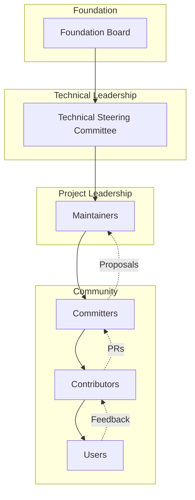
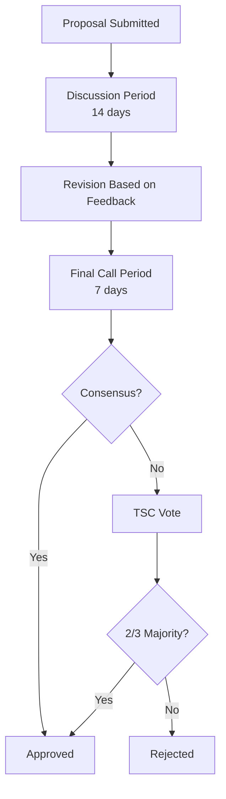
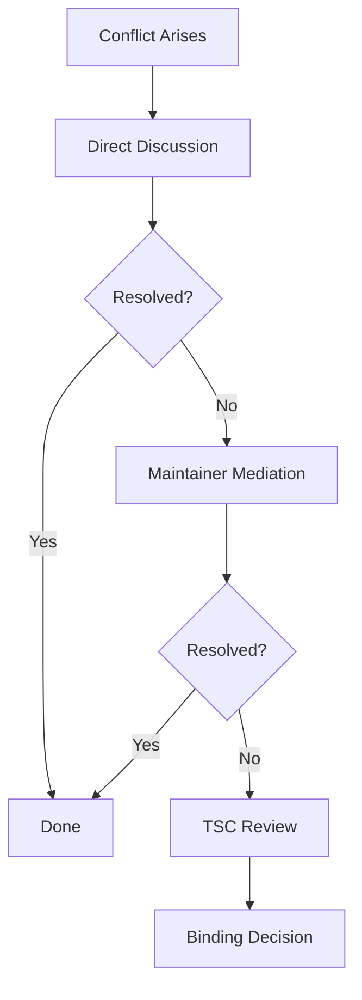

# Governance and Community

This document provides comprehensive documentation for UCID's governance structure, community guidelines, contribution recognition, and decision-making processes.

---

## Table of Contents

1. [Overview](#overview)
2. [Governance Model](#governance-model)
3. [Project Structure](#project-structure)
4. [Roles and Responsibilities](#roles-and-responsibilities)
5. [Decision Making](#decision-making)
6. [Working Groups](#working-groups)
7. [Community Guidelines](#community-guidelines)
8. [Communication Channels](#communication-channels)
9. [Contributor Recognition](#contributor-recognition)
10. [Events and Meetings](#events-and-meetings)
11. [Conflict Resolution](#conflict-resolution)
12. [Evolution and Amendments](#evolution-and-amendments)

---

## Overview

UCID is governed by the UCID Foundation with community participation through the Technical Steering Committee (TSC). This document outlines the governance structure that ensures transparent, fair, and effective project management.

### Governance Principles

| Principle | Description |
|-----------|-------------|
| **Transparency** | All decisions are documented publicly |
| **Meritocracy** | Influence based on contributions |
| **Inclusivity** | Welcome contributors from all backgrounds |
| **Consensus** | Seek agreement, vote when necessary |
| **Accountability** | Clear roles and responsibilities |

### Governance Model



---

## Project Structure

### Organization Hierarchy

| Level | Body | Responsibilities | Size |
|-------|------|------------------|------|
| Strategic | Foundation Board | Legal, financial, strategic | 5-7 |
| Technical | TSC | Technical direction | 5-9 |
| Operational | Maintainers | Day-to-day operations | 3-5 per module |
| Development | Committers | Code review, merge | 10-20 |
| Contribution | Contributors | Code, docs, testing | Unlimited |

### Repository Structure

| Repository | Ownership | Purpose |
|------------|-----------|---------|
| ucid/ucid | TSC | Core library |
| ucid/ucid-api | API WG | REST API service |
| ucid/ucid-docs | Docs WG | Documentation |
| ucid/ucid-infra | TSC | Infrastructure |
| ucid/ucid-examples | Community | Usage examples |

---

## Roles and Responsibilities

### Users

| Responsibility | Description |
|----------------|-------------|
| Report issues | File bug reports and feature requests |
| Provide feedback | Share experience and suggestions |
| Follow guidelines | Adhere to Code of Conduct |

### Contributors

| Responsibility | Description |
|----------------|-------------|
| Submit PRs | Code, documentation, tests |
| Respond to reviews | Address feedback promptly |
| Sign CLA | Contributor License Agreement |
| Follow standards | Code style, commit conventions |

### Committers

| Responsibility | Description |
|----------------|-------------|
| Review PRs | Provide constructive feedback |
| Merge changes | Approve and merge contributions |
| Mentor | Guide new contributors |
| Maintain quality | Ensure standards are met |

**Path to Committer:**
1. Regular high-quality contributions (10+ merged PRs)
2. Demonstrated understanding of codebase
3. Nomination by existing committer
4. TSC approval

### Maintainers

| Responsibility | Description |
|----------------|-------------|
| Module ownership | Responsible for specific modules |
| Architecture | Design decisions within module |
| Releases | Coordinate module releases |
| Roadmap | Plan module development |

**Path to Maintainer:**
1. Active committer for 6+ months
2. Deep expertise in module area
3. Nomination by current maintainer
4. TSC approval

### TSC Members

| Responsibility | Description |
|----------------|-------------|
| Technical direction | Overall architecture and standards |
| Policy | Development and release policies |
| Conflict resolution | Technical disputes |
| Community | Foster healthy community |
| Representation | Interface with Foundation Board |

**Path to TSC:**
1. Maintainer for 12+ months
2. Cross-module contributions
3. Community leadership
4. Nomination and election

### Foundation Board

| Responsibility | Description |
|----------------|-------------|
| Legal | Trademark, licensing |
| Financial | Budget, funding |
| Strategic | Long-term vision |
| Partnerships | Industry relationships |

---

## Decision Making

### Decision Types

| Type | Decision | Process | Examples |
|------|----------|---------|----------|
| Minor | Day-to-day operations | Individual maintainer | Bug fixes, doc updates |
| Standard | Module changes | Committer consensus | New features |
| Significant | Cross-module changes | TSC lazy consensus | API changes |
| Strategic | Project-wide | TSC vote | Major versions |

### Consensus Process



### Voting Rules

| Decision | Quorum | Threshold | Tie Breaker |
|----------|--------|-----------|-------------|
| Standard | 50% TSC | Simple majority | Chair |
| Significant | 66% TSC | 66% approval | Postpone |
| Strategic | 75% TSC | 75% approval | N/A |

### Proposal Template

```markdown
# Proposal: [Title]

## Summary
Brief description of the proposal.

## Motivation
Why is this change needed?

## Proposal
Detailed description of the change.

## Alternatives Considered
Other approaches and why they were rejected.

## Impact
- Breaking changes: Yes/No
- Migration required: Yes/No
- Documentation: Required updates

## Timeline
Proposed implementation timeline.
```

---

## Working Groups

### Active Working Groups

| Working Group | Focus | Chair | Meeting |
|---------------|-------|-------|---------|
| Context WG | Scoring algorithms | Elected | Bi-weekly |
| Spatial WG | H3, spatial operations | Elected | Bi-weekly |
| API WG | REST API design | Elected | Monthly |
| Docs WG | Documentation | Elected | Monthly |
| Security WG | Security practices | Appointed | As needed |

### Working Group Charter Template

```markdown
# [Name] Working Group Charter

## Mission
Purpose of the working group.

## Scope
What the WG covers and doesn't cover.

## Membership
How to join and participate.

## Decision Making
How decisions are made within the WG.

## Deliverables
Expected outputs of the WG.

## Communication
Meeting schedule and channels.
```

### Creating a Working Group

1. Draft charter
2. Gather 3+ interested participants
3. Submit proposal to TSC
4. TSC approval
5. Appoint initial chair
6. Begin operations

---

## Community Guidelines

### Code of Conduct

All participants must follow the [Code of Conduct](CODE_OF_CONDUCT.md):

- Be respectful and inclusive
- Welcome diverse perspectives
- Focus on constructive dialogue
- Report violations promptly

### Communication Guidelines

| Guideline | Description |
|-----------|-------------|
| Be professional | Maintain respectful tone |
| Stay on topic | Keep discussions relevant |
| Be concise | Value others' time |
| Assume good faith | Interpret charitably |
| Credit others | Acknowledge contributions |

---

## Communication Channels

### Official Channels

| Channel | Purpose | Response Time |
|---------|---------|---------------|
| GitHub Issues | Bugs, features | 48 hours |
| GitHub Discussions | Questions, ideas | 72 hours |
| Discord | Real-time chat | Best effort |
| Mailing List | Announcements | N/A |
| Twitter/X | News, updates | N/A |

### Meeting Cadence

| Meeting | Frequency | Participants | Recording |
|---------|-----------|--------------|-----------|
| Community Call | Monthly | Open | Yes |
| TSC Meeting | Bi-weekly | TSC members | Minutes |
| Working Group | Varies | WG members | Minutes |
| Office Hours | Weekly | Open | No |

---

## Contributor Recognition

### Recognition Levels

| Level | Criteria | Recognition |
|-------|----------|-------------|
| First Contribution | 1 merged PR | Welcome message, badge |
| Regular Contributor | 10+ merged PRs | Contributor badge |
| Notable Contributor | 25+ PRs, 6 months | Featured on website |
| Core Contributor | 50+ PRs, 12 months | Committer nomination |

### Annual Awards

| Award | Description | Selection |
|-------|-------------|-----------|
| Outstanding Contributor | Most impactful contributions | Community vote |
| Best Context Plugin | Top community context | TSC selection |
| Community Builder | Fostering community growth | Nomination |
| Documentation Champion | Best documentation work | TSC selection |

### Contributor Benefits

| Level | Benefits |
|-------|----------|
| Contributor | Name in CONTRIBUTORS.md |
| Committer | Write access, mention in releases |
| Maintainer | Conference sponsorship, swag |
| TSC | Travel support, leadership role |

---

## Events and Meetings

### Regular Events

| Event | Frequency | Format | Purpose |
|-------|-----------|--------|---------|
| Community Call | Monthly | Video | Updates, demos |
| Contributor Workshop | Quarterly | Video | Onboarding |
| Summit | Annual | In-person | Conference |
| Hackathon | Bi-annual | Hybrid | Sprint |

### Community Call Agenda

1. Welcome and introductions (5 min)
2. Project updates (15 min)
3. Feature demos (20 min)
4. Community spotlight (10 min)
5. Q&A (10 min)

---

## Conflict Resolution

### Resolution Process



### Escalation Levels

| Level | Handler | Timeframe |
|-------|---------|-----------|
| 1 | Direct parties | 1 week |
| 2 | Module maintainer | 2 weeks |
| 3 | TSC subcommittee | 3 weeks |
| 4 | Full TSC | 4 weeks |
| 5 | Foundation Board | As needed |

---

## Evolution and Amendments

### Governance Changes

Process for amending governance:

1. Proposal submitted to TSC
2. 30-day community comment period
3. Revision based on feedback
4. TSC vote (75% approval required)
5. Foundation Board ratification (if applicable)
6. 30-day implementation period

### Version History

| Version | Date | Changes |
|---------|------|---------|
| 1.0 | 2026-01-01 | Initial governance |
| 1.1 | 2026-06-01 | Added Working Groups |

---

Copyright 2026 UCID Foundation. All rights reserved.
