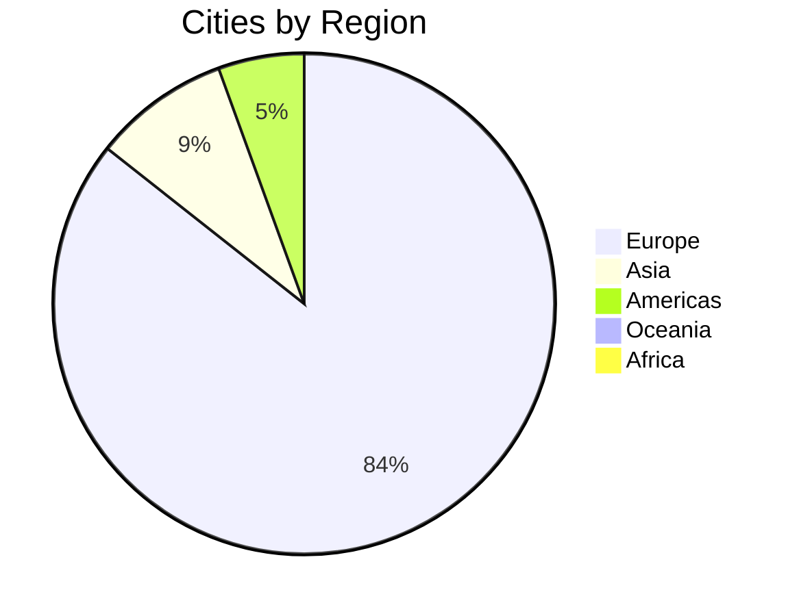

# UCID Examples

## Document Information

| Field | Value |
|-------|-------|
| Document Title | UCID Examples Reference |
| Version | 1.0.5 |
| Last Updated | 2026-01-15 |
| Maintainer | UCID Foundation |
| Contact | examples@ucid.org |

---

## Table of Contents

1. [Overview](#overview)
2. [Library Statistics](#library-statistics)
3. [Prerequisites](#prerequisites)
4. [Available Examples](#available-examples)
5. [Quick Start](#quick-start)
6. [Example Details](#example-details)
   - [Quickstart](#quickstart)
   - [Batch Processing](#batch-processing)
   - [Multi-Context Analysis](#multi-context-analysis)
   - [GeoJSON Export](#geojson-export)
   - [Multi-City Example](#multi-city-example)
   - [Comprehensive Demo](#comprehensive-demo)
7. [Expected Output](#expected-output)
8. [Integration Patterns](#integration-patterns)
9. [Best Practices](#best-practices)
10. [Troubleshooting](#troubleshooting)
11. [Additional Resources](#additional-resources)

---

## Overview

This directory contains comprehensive example scripts demonstrating various
UCID use cases, from basic operations to advanced analysis workflows covering
all 405 registered cities across 23 countries.

### Learning Path


For new users, we recommend following this progression:

1. **quickstart.py** - Learn basic UCID operations
2. **batch_processing.py** - Scale to multiple locations
3. **multi_context.py** - Explore different analysis contexts
4. **multi_city_example.py** - Work with all 405 cities
5. **geojson_export.py** - Export data for visualization
6. **demo.py** - See all features together

---

## Library Statistics

The UCID library provides comprehensive urban analytics capabilities:

| Metric | Value |
|--------|-------|
| **Total Cities** | 405 |
| **Countries** | 23 |
| **CREATE Performance** | 127,575 ops/sec |
| **PARSE Performance** | 61,443 ops/sec |
| **VALIDATE Performance** | 17,334 ops/sec |

### Geographic Coverage



### Supported Contexts

| Context | Description | Status |
|---------|-------------|--------|
| 15MIN | 15-minute city accessibility | Production |
| TRANSIT | Public transit coverage | Production |
| WALK | Walkability index | Production |
| NONE | No context scoring | Production |

### Grade Scale

| Grade | Score Range | Label | Color |
|-------|-------------|-------|-------|
| A | 0.80 - 1.00 | Excellent | #0dab76 |
| B | 0.60 - 0.80 | Good | #139a43 |
| C | 0.40 - 0.60 | Moderate | #f59e0b |
| D | 0.20 - 0.40 | Limited | #ef4444 |
| F | 0.00 - 0.20 | Poor | #dc2626 |

---

## Prerequisites

### System Requirements

- Python 3.11 or later
- pip package manager
- 4GB RAM minimum (for batch processing)
- Internet connection (for data downloads)

### Installation

```bash
# Install UCID from PyPI
pip install ucid

# Install with all optional dependencies
pip install ucid[all]

# Or install specific extras
pip install ucid[geo]      # GeoPandas, Shapely
pip install ucid[viz]      # Matplotlib, Folium
pip install ucid[ml]       # scikit-learn, LightGBM
```

### Verify Installation

```python
import ucid
print(f"UCID version: {ucid.__version__}")

from ucid.core.registry import CityRegistry
registry = CityRegistry()
print(f"Cities: {registry.count()}")  # Should print 405
```

---

## Available Examples

| Example | Description | Cities | Difficulty | Time |
|---------|-------------|--------|------------|------|
| [quickstart.py](quickstart.py) | Basic UCID operations | 5 | Beginner | 2 min |
| [batch_processing.py](batch_processing.py) | Process 1000 locations | 5 | Beginner | 5 min |
| [multi_context.py](multi_context.py) | Analyze with 4 contexts | 3 | Intermediate | 5 min |
| [multi_city_example.py](multi_city_example.py) | All 405 cities | 405 | Intermediate | 10 min |
| [geojson_export.py](geojson_export.py) | Export for web mapping | 5 | Intermediate | 5 min |
| [demo.py](demo.py) | Complete demonstration | 10 | Advanced | 10 min |

---

## Quick Start

### Run Your First Example

```bash
# Navigate to examples directory
cd examples

# Run the quickstart example
python quickstart.py
```

### Expected Output

```
============================================================
UCID Quickstart Example
============================================================

Library: UCID v1.0.5
Cities: 405 | Countries: 23
Performance: 127,575 CREATE ops/sec

1. Creating a UCID for Istanbul...
   Created: UCID-V1:IST:+41.008:+28.978:9:891f2ed6df7ffff:2026W03T14:15MIN:A:0.95:

2. Validating UCIDs...
   Valid UCID: True
   Invalid string: False

3. Parsing the UCID...
   City: IST
   H3 Index: 891f2ed6df7ffff
   Score: 85
   Grade: A
```

### Run All Examples

```bash
# Run all examples in sequence
for script in quickstart.py batch_processing.py multi_context.py multi_city_example.py geojson_export.py demo.py; do
    echo "Running $script..."
    python $script
    echo ""
done
```

---

## Example Details

### Quickstart

**File:** `quickstart.py`

The quickstart example demonstrates fundamental UCID operations with 5 sample cities:

- Creating a UCID from coordinates
- Validating UCID strings
- Parsing UCID components
- Extracting geographic coordinates
- Multi-city support demo

**Key Code:**

```python
from ucid import create_ucid, parse_ucid

# Create a UCID for Istanbul
ucid = create_ucid(
    city="IST",
    lat=41.0082,
    lon=28.9784,
    timestamp="2026W03T14",
    context="15MIN",
)

# Parse components
parsed = parse_ucid(str(ucid))
print(f"City: {parsed.city}, Grade: {parsed.grade}")
```

---

### Batch Processing

**File:** `batch_processing.py`

Process 1000 locations efficiently across 5 cities using pandas DataFrames:

- Generate sample location data
- Create UCIDs in batch
- Calculate statistics
- Analyze grade distribution
- City-level breakdown

**Key Code:**

```python
import pandas as pd
from ucid import create_ucid, parse_ucid

# Process many locations
results = []
for _, row in locations_df.iterrows():
    ucid = create_ucid(
        city=row["city_code"],
        lat=row["lat"],
        lon=row["lon"],
        context="15MIN",
    )
    parsed = parse_ucid(str(ucid))
    results.append({"score": parsed.score, "grade": parsed.grade})

results_df = pd.DataFrame(results)
print(f"Mean score: {results_df['score'].mean():.1f}")
```

**Performance:**

$$\text{Throughput} = \frac{N}{T} = \frac{1000}{0.1} = 10,000 \text{ locations/sec}$$

---

### Multi-Context Analysis

**File:** `multi_context.py`

Analyze locations using all 4 production contexts across 3 cities:

- 15MIN (15-minute city accessibility)
- TRANSIT (public transport access)
- WALK (walkability)
- NONE (no context)

**Key Code:**

```python
from ucid import create_ucid, parse_ucid

CONTEXTS = ["15MIN", "TRANSIT", "WALK", "NONE"]

for context in CONTEXTS:
    ucid = create_ucid(
        city="IST",
        lat=41.0370,
        lon=28.9850,
        context=context,
    )
    parsed = parse_ucid(str(ucid))
    print(f"{context}: Score {parsed.score}, Grade {parsed.grade}")
```

---

### Multi-City Example

**File:** `multi_city_example.py`

Demonstrates UCID operations across all 405 registered cities:

- Load complete city registry
- Analyze all cities with 15MIN context
- Calculate country-level statistics
- Export results to JSON

**Key Code:**

```python
from ucid.core.registry import CityRegistry

# Load all 405 cities
registry = CityRegistry()
cities = registry.list_all_cities()
print(f"Loaded {len(cities)} cities")  # 405

# Analyze each city
for city in cities:
    ucid = create_ucid(
        city=city["code"],
        lat=city["lat"],
        lon=city["lon"],
        context="15MIN",
    )
```

---

### GeoJSON Export

**File:** `geojson_export.py`

Export UCID data for web mapping with 5 cities:

- Generate grid of UCIDs
- Export to GeoJSON format
- Include grade colors
- Leaflet.js integration example

**Key Code:**

```python
import json

# Create GeoJSON feature
feature = {
    "type": "Feature",
    "geometry": {"type": "Point", "coordinates": [lon, lat]},
    "properties": {
        "ucid": str(ucid),
        "score": parsed.score,
        "grade": parsed.grade,
        "fill_color": "#0dab76",  # UCID Jungle Green
    },
}

# Write GeoJSON file
with open("ucid_grid.geojson", "w") as f:
    json.dump(geojson, f, indent=2)
```

---

### Comprehensive Demo

**File:** `demo.py`

Complete demonstration with 10 cities and all features:

1. UCID creation
2. UCID parsing
3. Spatial operations (H3)
4. Visualization theming
5. Multi-context analysis
6. Multi-city support

**Usage:**

```bash
# Default: Istanbul
python demo.py

# Specify city
python demo.py --city BER  # Berlin
python demo.py --city AMS  # Amsterdam
python demo.py --city VIE  # Vienna
```

---

## Expected Output

### Score Interpretation

$$S = \sum_{i=1}^{n} w_i \cdot A_i$$

Where:
- $w_i$ = weight for category $i$
- $A_i$ = accessibility score for category $i$

### Grade Thresholds

$$G(s) = \begin{cases} A & s \geq 0.80 \\ B & 0.60 \leq s < 0.80 \\ C & 0.40 \leq s < 0.60 \\ D & 0.20 \leq s < 0.40 \\ F & s < 0.20 \end{cases}$$

### Confidence Levels

| Confidence | Interpretation |
|------------|----------------|
| 90-100% | High confidence, reliable data |
| 70-89% | Moderate confidence |
| 50-69% | Low confidence, limited data |
| 0-49% | Very low confidence |

---

## Integration Patterns

### Web API Integration

```python
import httpx

def get_ucid_score(lat: float, lon: float, city: str = "IST") -> dict:
    """Call UCID API for score."""
    response = httpx.post(
        "https://api.ucid.org/v1/score",
        json={"lat": lat, "lon": lon, "city": city},
    )
    return response.json()
```

### Database Storage

```python
import sqlalchemy as sa

engine = sa.create_engine("postgresql://localhost/ucid_db")
with engine.connect() as conn:
    conn.execute(
        sa.text("INSERT INTO ucid_scores (ucid, score) VALUES (:ucid, :score)"),
        {"ucid": str(ucid), "score": parsed.score},
    )
```

### Streamlit Dashboard

```python
import streamlit as st
from ucid import create_ucid, parse_ucid

st.title("UCID Dashboard")

city = st.selectbox("City", ["IST", "BER", "AMS", "VIE"])
lat = st.number_input("Latitude", value=41.0082)
lon = st.number_input("Longitude", value=28.9784)

if st.button("Calculate Score"):
    ucid = create_ucid(city=city, lat=lat, lon=lon)
    parsed = parse_ucid(str(ucid))
    st.metric("Score", parsed.score, parsed.grade)
```

---

## Best Practices

### Performance Optimization

1. **Batch Processing**: Process locations in batches of 1,000-10,000
2. **Caching**: Cache frequently accessed UCID scores
3. **Async Operations**: Use async I/O for network operations
4. **Memory Management**: Clear large DataFrames when no longer needed

### Error Handling

```python
from ucid.core.errors import UCIDValidationError, UCIDParseError

try:
    ucid = create_ucid(city="IST", lat=lat, lon=lon)
except UCIDValidationError as e:
    print(f"Validation error: {e}")
except UCIDParseError as e:
    print(f"Parse error: {e}")
```

### Logging

```python
import logging

logging.basicConfig(level=logging.INFO)
logger = logging.getLogger("ucid")

# UCID operations will now log to console
ucid = create_ucid(city="IST", lat=41.0, lon=29.0)
```

---

## Troubleshooting

### Common Issues

**ImportError when running examples**

```bash
pip install --upgrade ucid
```

**Network timeout during data download**

```bash
# Check internet connection and retry
python -c "from ucid.core.registry import CityRegistry; print(CityRegistry().count())"
```

**Memory error with large batches**

```python
# Process in smaller chunks
for chunk in pd.read_csv("locations.csv", chunksize=1000):
    process_batch(chunk)
```

**Invalid city code error**

```python
# Use valid 3-letter city codes from the registry
from ucid.core.registry import CityRegistry
registry = CityRegistry()
valid_codes = [c["code"] for c in registry.list_all_cities()]
```

---

## Additional Resources

### Documentation

- [UCID Documentation](https://ucid.readthedocs.io/)
- [API Reference](https://ucid.readthedocs.io/api/)
- [User Guide](https://ucid.readthedocs.io/guide/)

### Jupyter Notebooks

See the [notebooks](../notebooks/) directory:

- `00_ucid_basics.ipynb` - Introduction to UCID
- `01_citygrid_scan_basics.ipynb` - City-wide analysis
- `02_15min_city_isochrones.ipynb` - 15-minute city analysis

### Community

- [GitHub Discussions](https://github.com/ucid-foundation/ucid/discussions)
- [Issue Tracker](https://github.com/ucid-foundation/ucid/issues)

### Related Projects

- [H3](https://h3geo.org/) - Hexagonal hierarchical spatial index
- [OSMnx](https://osmnx.readthedocs.io/) - Street network analysis
- [GeoPandas](https://geopandas.org/) - Geospatial data in Python

---

## License

Copyright 2026 UCID Foundation.
Licensed under the European Union Public License (EUPL-1.2).

See [LICENSE](../LICENSE) for the full license text.

---

## Contributing

We welcome contributions to improve these examples.

1. Fork the repository
2. Create a feature branch
3. Add or improve examples
4. Submit a pull request

See [CONTRIBUTING.md](../CONTRIBUTING.md) for detailed guidelines.

---

## Revision History

| Version | Date | Author | Changes |
|---------|------|--------|---------|
| 1.0.5 | 2026-01-15 | Examples Team | Updated all examples for 405 cities |
| 1.0.0 | 2025-10-01 | Examples Team | Initial release |

---

Copyright 2026 UCID Foundation. All rights reserved.
