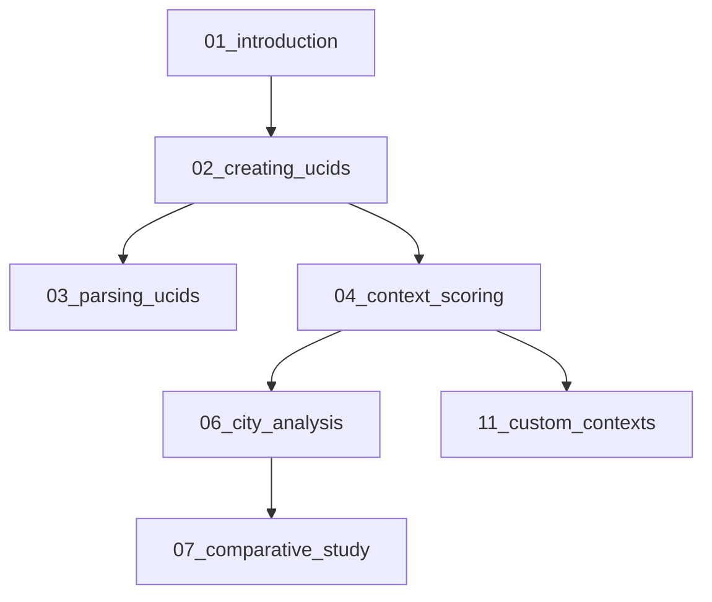

# UCID Notebooks

This directory contains Jupyter notebooks demonstrating UCID functionality through interactive examples and tutorials.

---

## Table of Contents

1. [Overview](#overview)
2. [Getting Started](#getting-started)
3. [Notebook Index](#notebook-index)
4. [Running Notebooks](#running-notebooks)
5. [Development](#development)
6. [Contributing](#contributing)

---

## Overview

The UCID notebooks provide hands-on tutorials and examples for learning and using the UCID library. Each notebook is self-contained and includes explanations, code, and visualizations.

### Notebook Categories

| Category | Description | Notebooks |
|----------|-------------|-----------|
| **Tutorials** | Step-by-step learning | 01-05 |
| **Examples** | Real-world use cases | 06-10 |
| **Advanced** | Deep dives | 11-15 |
| **Visualization** | Mapping and charts | 16-20 |

---

## Getting Started

### Prerequisites

Before running the notebooks, ensure you have:

1. Python 3.11 or higher
2. UCID installed with visualization dependencies
3. Jupyter Lab or Jupyter Notebook

### Installation

```bash
# Install UCID with notebook dependencies
pip install "UCID[viz,contexts]"

# Install Jupyter
pip install jupyterlab

# Start Jupyter
jupyter lab
```

### Required Packages

| Package | Purpose | Installation |
|---------|---------|--------------|
| jupyterlab | Notebook environment | pip install jupyterlab |
| folium | Interactive maps | Included in [viz] |
| plotly | Interactive charts | Included in [viz] |
| matplotlib | Static plots | Included in [viz] |

---

## Notebook Index

### Tutorial Notebooks

| Notebook | Title | Description | Difficulty |
|----------|-------|-------------|------------|
| 01_introduction.ipynb | Introduction to UCID | Basic concepts and first UCID | Beginner |
| 02_creating_ucids.ipynb | Creating UCIDs | All creation methods | Beginner |
| 03_parsing_ucids.ipynb | Parsing and Validation | Parse and validate UCIDs | Beginner |
| 04_context_scoring.ipynb | Context Scoring | Score locations with contexts | Intermediate |
| 05_spatial_operations.ipynb | Spatial Operations | H3 grids and spatial analysis | Intermediate |

### Example Notebooks

| Notebook | Title | Description | Difficulty |
|----------|-------|-------------|------------|
| 06_city_analysis.ipynb | City-Wide Analysis | Score an entire city | Intermediate |
| 07_comparative_study.ipynb | Comparing Cities | Multi-city comparison | Intermediate |
| 08_temporal_analysis.ipynb | Temporal Analysis | Time series of scores | Advanced |
| 09_transit_integration.ipynb | GTFS Integration | Public transit analysis | Advanced |
| 10_policy_evaluation.ipynb | Policy Evaluation | Before/after analysis | Advanced |

### Advanced Notebooks

| Notebook | Title | Description | Difficulty |
|----------|-------|-------------|------------|
| 11_custom_contexts.ipynb | Custom Contexts | Build your own context | Advanced |
| 12_ml_predictions.ipynb | ML Predictions | Predict missing scores | Advanced |
| 13_distributed_processing.ipynb | Distributed Computing | Scale with Dask | Expert |
| 14_database_integration.ipynb | PostGIS Integration | Database workflows | Expert |
| 15_api_development.ipynb | API Development | Build custom APIs | Expert |

### Visualization Notebooks

| Notebook | Title | Description | Difficulty |
|----------|-------|-------------|------------|
| 16_interactive_maps.ipynb | Interactive Maps | Folium visualizations | Beginner |
| 17_choropleth_maps.ipynb | Choropleth Maps | H3 hexagon maps | Intermediate |
| 18_dashboard_creation.ipynb | Dashboards | Plotly dashboards | Intermediate |
| 19_publication_figures.ipynb | Publication Figures | Matplotlib for papers | Intermediate |
| 20_animation.ipynb | Animated Maps | Temporal animations | Advanced |

---

## Running Notebooks

### Local Execution

```bash
# Navigate to notebooks directory
cd notebooks

# Start Jupyter Lab
jupyter lab

# Or start classic notebook
jupyter notebook
```

### Google Colab

Each notebook includes a "Open in Colab" button. Example:

```python
# Install UCID in Colab
!pip install UCID[viz,contexts]
```

### Binder

Launch interactive notebooks without installation:

[](https://mybinder.org/v2/gh/ucid-foundation/ucid/main?labpath=notebooks)

---

## Development

### Creating New Notebooks

Follow these guidelines when creating notebooks:

1. **Clear Structure**: Use markdown headings to organize content
2. **Cell Independence**: Each cell should be runnable independently
3. **Documentation**: Include explanatory text between code cells
4. **Visualization**: Include output visualizations
5. **Cleanup**: Clear outputs before committing

### Notebook Template

```markdown
# Notebook Title

## Overview
Brief description of what this notebook covers.

## Prerequisites
- Required packages
- Required data

## Setup
Import statements and configuration.

## Main Content
Step-by-step tutorial or example.

## Conclusion
Summary of what was learned.

## Next Steps
Links to related notebooks.
```

### Testing Notebooks

```bash
# Install testing tools
pip install nbmake

# Run all notebooks as tests
pytest --nbmake notebooks/
```

---

## Contributing

### Guidelines

1. Follow the notebook template
2. Include all required imports
3. Test with clean kernel
4. Clear outputs before committing
5. Add notebook to index

### Submitting Notebooks

1. Fork the repository
2. Create a feature branch
3. Add your notebook
4. Update this README
5. Submit pull request

---

## Data Requirements

Some notebooks require additional data:

| Data | Source | Size | Notebooks |
|------|--------|------|-----------|
| Istanbul OSM | OSM Extract | 50 MB | 06, 16-20 |
| Istanbul GTFS | IETT | 20 MB | 09 |
| Sample Scores | Included | 5 MB | All |

### Downloading Data

```python
from ucid.data import download_sample_data

# Download sample data for tutorials
download_sample_data("istanbul_sample")
```

---

## Troubleshooting

### Common Issues

| Issue | Solution |
|-------|----------|
| Import error | Reinstall UCID with extras |
| Map not displaying | Install ipywidgets |
| Memory error | Reduce grid resolution |
| Slow execution | Enable caching |

### Getting Help

- GitHub Issues
- GitHub Discussions
- Discord channel

---

## Learning Paths

### Path 1: Urban Analyst

For urban planners and analysts new to programming:

| Step | Notebook | Duration |
|------|----------|----------|
| 1 | 01_introduction.ipynb | 30 min |
| 2 | 02_creating_ucids.ipynb | 45 min |
| 3 | 16_interactive_maps.ipynb | 60 min |
| 4 | 06_city_analysis.ipynb | 90 min |
| 5 | 17_choropleth_maps.ipynb | 60 min |

### Path 2: Data Scientist

For data scientists with Python experience:

| Step | Notebook | Duration |
|------|----------|----------|
| 1 | 01_introduction.ipynb | 15 min |
| 2 | 04_context_scoring.ipynb | 45 min |
| 3 | 05_spatial_operations.ipynb | 45 min |
| 4 | 12_ml_predictions.ipynb | 90 min |
| 5 | 13_distributed_processing.ipynb | 90 min |

### Path 3: Developer

For software developers building applications:

| Step | Notebook | Duration |
|------|----------|----------|
| 1 | 01_introduction.ipynb | 15 min |
| 2 | 03_parsing_ucids.ipynb | 30 min |
| 3 | 14_database_integration.ipynb | 60 min |
| 4 | 15_api_development.ipynb | 90 min |
| 5 | 11_custom_contexts.ipynb | 90 min |

---

## Notebook Best Practices

### Code Style

| Practice | Example |
|----------|---------|
| **Clear imports** | Group and comment imports |
| **Meaningful names** | `istanbul_scores` not `df1` |
| **Output limits** | Use `.head()` for large DataFrames |
| **Comments** | Explain non-obvious operations |

### Performance Tips

| Tip | Benefit |
|-----|---------|
| Set H3 resolution appropriately | Balance detail vs. speed |
| Use caching | Avoid repeated API calls |
| Process in batches | Manage memory |
| Use progress bars | Track long operations |

### Reproducibility

| Practice | Implementation |
|----------|----------------|
| Pin dependencies | `requirements.txt` |
| Set random seeds | `random.seed(42)` |
| Document versions | Print library versions |
| Use relative paths | `Path(__file__).parent` |

---

## Notebook Output Examples

### Map Visualization

The visualization notebooks produce interactive maps:

- Choropleth maps of context scores
- Point maps of sampled locations
- Heatmaps of score distributions
- Animated temporal visualizations

### Statistical Output

Analysis notebooks produce:

- Summary statistics tables
- Distribution histograms
- Correlation matrices
- Regression results

### Export Formats

Notebooks can export results to:

| Format | Use Case |
|--------|----------|
| GeoJSON | Web maps |
| GeoParquet | Further analysis |
| PNG/SVG | Publications |
| HTML | Reports |

---

## Integration with IDEs

### VS Code

1. Install Python extension
2. Install Jupyter extension
3. Open notebook files directly
4. Use integrated terminal

### PyCharm

1. Professional edition required
2. Native notebook support
3. Debugger integration

### JupyterLab

Recommended environment with:

- File browser
- Terminal access
- Extension ecosystem
- Dark mode support

---

## Notebook Execution Order

### Dependencies

Some notebooks depend on outputs from others:



### Data Pipeline

For full city analysis:

1. Run 01-03 for basics
2. Run 06 to generate city data
3. Run 16-17 for visualizations
4. Run 08 for temporal analysis

---

## Versioning

### Compatibility

| UCID Version | Notebook Version | Status |
|--------------|------------------|--------|
| 1.0.x | 1.0 | Current |
| 0.9.x | 0.9 | Supported |
| 0.8.x | 0.8 | Archived |

### Changelog

- **v1.0** (2026-01): Initial release with 20 notebooks
- **v0.9** (2025-12): Beta notebooks for testing
- **v0.8** (2025-10): Alpha development notebooks

---

## Resources

### External Resources

- [UCID Documentation](https://ucid.readthedocs.io/)
- [H3 Documentation](https://h3geo.org/)
- [GeoPandas Documentation](https://geopandas.org/)
- [Folium Documentation](https://python-folium.readthedocs.io/)

### Related Projects

- Urban Observatory
- OpenStreetMap
- GTFS Tools
- Kepler.gl

---

## Citation

If you use these notebooks in your research:

```bibtex
@software{ucid_notebooks_2026,
  author = {UCID Foundation},
  title = {UCID Notebooks: Interactive Urban Analysis Tutorials},
  year = {2026},
  url = {https://github.com/ucid-foundation/ucid/tree/main/notebooks}
}
```

---

## License

These notebooks are released under the EUPL-1.2 license, consistent with the main UCID project.

---

Copyright 2026 UCID Foundation. All rights reserved.
