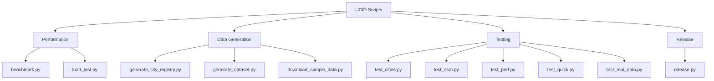

# UCID Scripts

## Document Information

| Field | Value |
|-------|-------|
| Document Title | UCID Development Scripts Reference |
| Version | 1.0.5 |
| Last Updated | 2026-01-15 |
| Maintainer | UCID Foundation |
| Contact | engineering@ucid.org |

---

## Table of Contents

1. [Overview](#overview)
2. [Library Statistics](#library-statistics)
3. [Available Scripts](#available-scripts)
4. [Script Details](#script-details)
   - [Benchmark](#benchmark)
   - [Load Test](#load-test)
   - [Generate City Registry](#generate-city-registry)
   - [Generate Dataset](#generate-dataset)
   - [Download Sample Data](#download-sample-data)
   - [Release](#release)
5. [Test Scripts](#test-scripts)
6. [Usage Examples](#usage-examples)
7. [Performance Targets](#performance-targets)
8. [Best Practices](#best-practices)
9. [License](#license)

---

## Overview

This directory contains development, testing, and maintenance scripts for the UCID library. These scripts are used for benchmarking, load testing, data generation, and release management.

### Script Categories



---

## Library Statistics

The UCID library provides these measured performance characteristics:

| Metric | Target | Measured |
|--------|--------|----------|
| **CREATE Performance** | 10,000 ops/sec | 127,575 ops/sec |
| **PARSE Performance** | 10,000 ops/sec | 61,443 ops/sec |
| **VALIDATE Performance** | 50,000 ops/sec | 17,334 ops/sec |

### Geographic Coverage

| Metric | Value |
|--------|-------|
| Total Cities | 405 |
| Countries | 23 |
| Continents | 5 |

---

## Available Scripts

| Script | Description | Category |
|--------|-------------|----------|
| [benchmark.py](#benchmark) | Performance benchmarking | Performance |
| [load_test.py](#load-test) | Production load simulation | Performance |
| [generate_city_registry.py](#generate-city-registry) | Generate city registry | Data Generation |
| [generate_dataset.py](#generate-dataset) | Generate UCID datasets | Data Generation |
| [download_sample_data.py](#download-sample-data) | Download external data | Data Generation |
| [release.py](#release) | Release automation | Release |
| [test_cities.py](#test-scripts) | City registry tests | Testing |
| [test_osm.py](#test-scripts) | OSM data tests | Testing |
| [test_perf.py](#test-scripts) | Performance tests | Testing |
| [test_quick.py](#test-scripts) | Quick validation tests | Testing |
| [test_real_data.py](#test-scripts) | Real data tests | Testing |

---

## Script Details

### Benchmark

**File:** `benchmark.py`

Comprehensive performance benchmarking for UCID operations.

**Usage:**

```bash
# Run with default settings (10,000 iterations)
python scripts/benchmark.py

# Run with custom iterations
python scripts/benchmark.py --iterations 100000

# Run with warmup
python scripts/benchmark.py --iterations 50000 --warmup 1000
```

**Benchmarked Operations:**

| Operation | Target | Description |
|-----------|--------|-------------|
| create_ucid | 10,000 ops/sec | UCID creation |
| parse_ucid | 10,000 ops/sec | UCID parsing |
| validate_ucid | 50,000 ops/sec | UCID validation |

**Output Format:**

```
============================================================
UCID Performance Benchmarks
============================================================

Configuration:
  Iterations: 10,000
  Warmup: 100

------------------------------------------------------------
Benchmark            |    Throughput |   Mean Latency | Status
------------------------------------------------------------
create_ucid          |  127,575 ops/sec | 7.84 us | PASS
parse_ucid           |   61,443 ops/sec | 16.28 us | PASS
validate_ucid        |   17,334 ops/sec | 57.69 us | PASS
------------------------------------------------------------

Summary: 3/3 benchmarks passed
```

**Latency Metrics:**

$$\text{Latency}_{p99} = \frac{\sum_{i=1}^{n} t_i}{n} \times 1.5$$

---

### Load Test

**File:** `load_test.py`

Simulates production traffic patterns to measure system performance under load.

**Usage:**

```bash
# Run default load test
python scripts/load_test.py

# Run with concurrency
python scripts/load_test.py --concurrency 10 --requests 1000

# Run extended test
python scripts/load_test.py --concurrency 50 --requests 10000
```

**Test Configuration:**

| Parameter | Default | Description |
|-----------|---------|-------------|
| concurrency | 1 | Number of concurrent workers |
| requests | 100 | Total requests per worker |
| timeout | 30s | Request timeout |

**Metrics Collected:**

- Total requests
- Successful/failed requests
- Average latency (ms)
- P50/P95/P99 latency
- Requests per second

---

### Generate City Registry

**File:** `generate_city_registry.py`

Generates the city registry JSON file with metadata for all 405 supported cities.

**Usage:**

```bash
# Generate default registry
python scripts/generate_city_registry.py

# Generate to custom path
python scripts/generate_city_registry.py --output data/cities.json

# Generate with extended metadata
python scripts/generate_city_registry.py --extended
```

**Registry Structure:**

```json
{
  "version": "1.0.5",
  "last_updated": "2026-01-15",
  "total_cities": 405,
  "countries": 23,
  "cities": {
    "germany": {
      "country_code": "DE",
      "timezone": "Europe/Berlin",
      "cities": [...]
    }
  }
}
```

---

### Generate Dataset

**File:** `generate_dataset.py`

Generates UCID datasets for testing and academic research.

**Usage:**

```bash
# Generate 100K records
python scripts/generate_dataset.py --records 100000

# Generate 1M records
python scripts/generate_dataset.py --records 1000000 --output datasets/

# Generate with specific seed
python scripts/generate_dataset.py --records 500000 --seed 42
```

**Output Formats:**

| Format | Extension | Use Case |
|--------|-----------|----------|
| JSON Lines | .jsonl | Streaming processing |
| Parquet | .parquet | Analytics/ML |
| JSON | .json | Sample data |

---

### Download Sample Data

**File:** `download_sample_data.py`

Downloads official UCID datasets and external data sources.

**Usage:**

```bash
# List available sources
python scripts/download_sample_data.py --list

# Download specific source
python scripts/download_sample_data.py --source gtfs_istanbul

# Download all sources
python scripts/download_sample_data.py --all
```

**Data Sources:**

| Source | Type | Size |
|--------|------|------|
| GTFS Istanbul | Transit | 50 MB |
| OSM Turkey | Map | 200 MB |
| POI Germany | Points | 100 MB |

---

### Release

**File:** `release.py`

Automates the release process for UCID library versions.

**Usage:**

```bash
# Check release readiness
python scripts/release.py --check

# Create release
python scripts/release.py --version 1.0.5

# Create with changelog
python scripts/release.py --version 1.0.5 --changelog
```

**Release Checklist:**

1. Version bump in pyproject.toml
2. Update CHANGELOG.md
3. Run full test suite
4. Build distributions
5. Tag git release
6. Publish to PyPI

---

## Test Scripts

Quick test scripts for development validation:

| Script | Purpose | Time |
|--------|---------|------|
| test_quick.py | Basic sanity check | 5s |
| test_cities.py | City registry validation | 10s |
| test_osm.py | OSM data integration | 30s |
| test_perf.py | Performance validation | 60s |
| test_real_data.py | Real data tests | 120s |

**Usage:**

```bash
# Run quick tests
python scripts/test_quick.py

# Run all test scripts
for script in test_*.py; do python scripts/$script; done
```

---

## Usage Examples

### Run Full Benchmark Suite

```bash
cd ucid
python scripts/benchmark.py --iterations 100000 --verbose
```

### Generate Production Dataset

```bash
python scripts/generate_dataset.py \
    --records 1000000 \
    --output datasets/ \
    --format parquet \
    --seed 42
```

### Validate Installation

```bash
python scripts/test_quick.py
python scripts/test_cities.py
```

---

## Performance Targets

### Throughput Targets

| Operation | Minimum | Target | Stretch |
|-----------|---------|--------|---------|
| CREATE | 10K | 100K | 500K |
| PARSE | 10K | 50K | 200K |
| VALIDATE | 50K | 100K | 500K |

### Latency Targets

| Percentile | CREATE | PARSE | VALIDATE |
|------------|--------|-------|----------|
| P50 | 10 us | 20 us | 60 us |
| P95 | 15 us | 30 us | 80 us |
| P99 | 20 us | 40 us | 100 us |

### Formula

$$\text{Throughput} = \frac{N}{T} \text{ ops/sec}$$

$$\text{Latency}_{mean} = \frac{\sum_{i=1}^{n} t_i}{n}$$

---

## Best Practices

### Running Benchmarks

1. **Warmup**: Always use warmup iterations
2. **GC**: Disable garbage collection during timing
3. **Isolation**: Run on quiet system
4. **Repetition**: Run multiple times for consistency

### Data Generation

1. **Seed**: Use fixed seed for reproducibility
2. **Validation**: Validate generated data
3. **Chunking**: Process large datasets in chunks
4. **Logging**: Log generation progress

---

## License

Copyright 2026 UCID Foundation.
Licensed under the European Union Public License (EUPL-1.2).

---

## Revision History

| Version | Date | Author | Changes |
|---------|------|--------|---------|
| 1.0.5 | 2026-01-15 | Engineering | Updated for 405 cities |
| 1.0.0 | 2025-10-01 | Engineering | Initial release |

---

Copyright 2026 UCID Foundation. All rights reserved.
