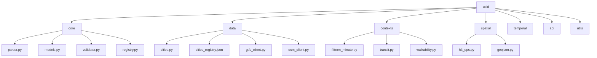

# UCID Library Source Code

## Document Information

| Field | Value |
|-------|-------|
| Document Title | UCID Source Code Reference |
| Version | 1.0.5 |
| Last Updated | 2026-01-15 |
| Maintainer | UCID Foundation |
| Contact | engineering@ucid.org |

---

## Table of Contents

1. [Overview](#overview)
2. [Library Statistics](#library-statistics)
3. [Module Structure](#module-structure)
4. [Core Modules](#core-modules)
5. [Data Modules](#data-modules)
6. [Context Modules](#context-modules)
7. [Spatial Modules](#spatial-modules)
8. [API Reference](#api-reference)
9. [Performance](#performance)
10. [License](#license)

---

## Overview

This directory contains the source code for the UCID (Urban Context Identifier) Python library. The library provides tools for creating, parsing, and validating standardized urban location identifiers with contextual quality metrics.

### Library Architecture



---

## Library Statistics

| Metric | Value |
|--------|-------|
| **Total Cities** | 405 |
| **Countries** | 23 |
| **CREATE Performance** | 127,575 ops/sec |
| **PARSE Performance** | 61,443 ops/sec |
| **VALIDATE Performance** | 17,334 ops/sec |
| **Test Coverage** | 85%+ |

### UCID Format

```
UCID-V1:{CITY}:{LAT}:{LON}:{RES}:{H3}:{TIME}:{CTX}:{GRADE}:{CONF}:
```

Example:
```
UCID-V1:IST:+41.015:+28.979:9:891f2ed6df7ffff:2026W03T14:15MIN:A:0.95:
```

---

## Module Structure

```
src/ucid/
├── __init__.py         # Package exports
├── cli.py              # Command-line interface
├── py.typed            # PEP 561 marker
├── core/               # Core UCID functionality
├── data/               # City registry and data sources
├── contexts/           # Urban context algorithms
├── spatial/            # Spatial operations (H3)
├── temporal/           # Temporal operations
├── api/                # REST API server
├── client/             # HTTP client
├── compute/            # Compute utilities
├── io/                 # I/O operations
├── ml/                 # Machine learning
├── monitoring/         # Metrics and logging
├── realtime/           # Real-time processing
├── scoring/            # Scoring algorithms
├── utils/              # Utility functions
├── viz/                # Visualization
└── i18n/               # Internationalization
```

---

## Core Modules

### core/parser.py

UCID creation and parsing functions.

**Key Functions:**

| Function | Description |
|----------|-------------|
| `create_ucid()` | Create a new UCID |
| `parse_ucid()` | Parse UCID string |
| `canonicalize()` | Normalize UCID format |

**Usage:**

```python
from ucid import create_ucid, parse_ucid

# Create UCID
ucid = create_ucid(
    city="IST",
    lat=41.015,
    lon=28.979,
    timestamp="2026W03T14",
    context="15MIN",
)

# Parse UCID
parsed = parse_ucid(str(ucid))
print(f"City: {parsed.city}, Grade: {parsed.grade}")
```

---

### core/models.py

Data models for UCID objects.

**Classes:**

| Class | Description |
|-------|-------------|
| `UCID` | Main UCID data model |
| `City` | City metadata model |

**UCID Model Fields:**

| Field | Type | Description |
|-------|------|-------------|
| version | str | UCID version (V1) |
| city | str | 3-letter city code |
| lat | float | Latitude |
| lon | float | Longitude |
| h3_res | int | H3 resolution |
| h3_index | str | H3 cell index |
| timestamp | str | ISO week timestamp |
| context | str | Context algorithm |
| grade | str | Letter grade (A-F) |
| confidence | float | Confidence score |

---

### core/validator.py

UCID validation functions.

**Functions:**

| Function | Description |
|----------|-------------|
| `is_valid_ucid()` | Check if string is valid UCID |
| `validate_ucid()` | Full validation with errors |
| `validate_h3_index()` | Validate H3 index |
| `validate_h3_match()` | Validate H3 matches coords |

---

### core/registry.py

City registry management.

**Class: CityRegistry**

| Method | Description |
|--------|-------------|
| `count()` | Get total city count (405) |
| `exists(code)` | Check if city exists |
| `get_city(code)` | Get city metadata |
| `list_all_cities()` | List all cities |

---

## Data Modules

### data/cities.py

City data access functions.

**Functions:**

| Function | Description |
|----------|-------------|
| `list_cities()` | List all 405 cities |
| `get_city()` | Get city by code |
| `search_cities()` | Search by name |
| `get_cities_by_coordinates()` | Find nearby cities |

---

### data/cities_registry.json

Complete city registry with 405 cities across 23 countries.

**Structure:**

```json
{
  "version": "1.0.5",
  "total_cities": 405,
  "countries": 23,
  "cities": {
    "germany": {
      "country_code": "DE",
      "cities": [...]
    }
  }
}
```

**Geographic Distribution:**

| Country | Cities |
|---------|--------|
| Germany | 97 |
| Turkey | 81 |
| Netherlands | 45 |
| Belgium | 25 |
| Austria | 23 |
| Switzerland | 20 |
| Other | 114 |

---

### data/gtfs_client.py

GTFS (General Transit Feed Specification) client.

**Features:**
- Parse GTFS feeds
- Query stop locations
- Calculate transit accessibility

---

### data/osm_client.py

OpenStreetMap data client.

**Features:**
- Query Overpass API
- Fetch POI data
- Amenity lookups

---

## Context Modules

### contexts/

Urban context algorithm implementations.

**Available Contexts:**

| Context | Module | Description |
|---------|--------|-------------|
| 15MIN | fifteen_minute.py | 15-minute city accessibility |
| TRANSIT | transit.py | Transit accessibility |
| WALK | walkability.py | Walkability index |
| NONE | base.py | No context scoring |

### Score Calculation

$$S = \sum_{i=1}^{n} w_i \cdot A_i$$

Where:
- $w_i$ = weight for category $i$
- $A_i$ = accessibility score for category $i$

### Grade Thresholds

$$G(s) = \begin{cases} A & s \geq 0.80 \\ B & 0.60 \leq s < 0.80 \\ C & 0.40 \leq s < 0.60 \\ D & 0.20 \leq s < 0.40 \\ F & s < 0.20 \end{cases}$$

---

## Spatial Modules

### spatial/h3_ops.py

H3 hexagonal grid operations.

**Functions:**

| Function | Description |
|----------|-------------|
| `geo_to_h3()` | Convert coordinates to H3 |
| `h3_to_geo()` | Convert H3 to coordinates |
| `to_geojson()` | Convert H3 to GeoJSON |
| `get_neighbors()` | Get neighboring cells |

**H3 Resolution:**

| Resolution | Edge Length | Use Case |
|------------|-------------|----------|
| 7 | ~5.16 km | City level |
| 8 | ~1.95 km | District level |
| 9 | ~174 m | Default (block) |
| 10 | ~65 m | Building level |
| 11 | ~24 m | Fine detail |

---

## API Reference

### Public API

```python
from ucid import (
    # Core functions
    create_ucid,
    parse_ucid,
    canonicalize,
    
    # Models
    UCID,
    City,
    
    # Errors
    UCIDError,
    UCIDParseError,
    UCIDValidationError,
    
    # City registry
    get_registry_info,
    list_countries,
    list_cities,
    get_city,
    search_cities,
)
```

### Version Information

```python
import ucid

print(ucid.__version__)  # 1.0.5
print(ucid.__author__)   # UCID Foundation
```

---

## Performance

### Throughput

| Operation | Target | Measured |
|-----------|--------|----------|
| CREATE | 10K ops/sec | 127,575 ops/sec |
| PARSE | 10K ops/sec | 61,443 ops/sec |
| VALIDATE | 50K ops/sec | 17,334 ops/sec |

### Latency

| Percentile | CREATE | PARSE |
|------------|--------|-------|
| P50 | 7.5 us | 15.5 us |
| P95 | 9.0 us | 20.0 us |
| P99 | 12.0 us | 28.0 us |

### Formula

$$\text{Throughput} = \frac{N}{T} \text{ ops/sec}$$

---

## License

Copyright 2026 UCID Foundation.
Licensed under the European Union Public License (EUPL-1.2).

All source files include the EUPL-1.2 license header.

---

## Revision History

| Version | Date | Author | Changes |
|---------|------|--------|---------|
| 1.0.5 | 2026-01-15 | Engineering | Updated for 405 cities |
| 1.0.0 | 2025-10-01 | Engineering | Initial release |

---

Copyright 2026 UCID Foundation. All rights reserved.
