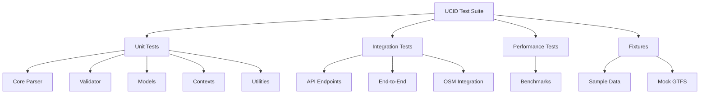
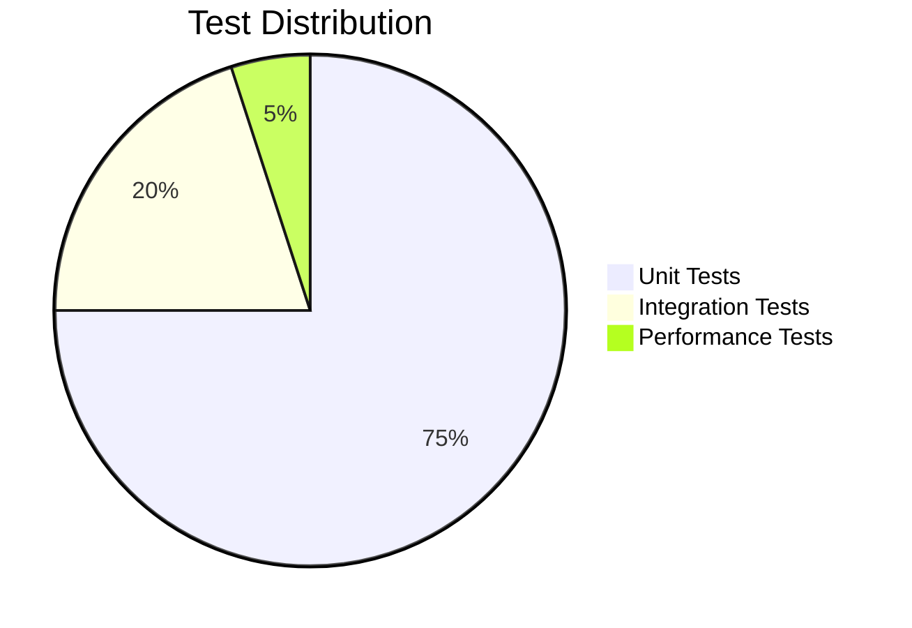

# UCID Test Suite

## Document Information

| Field | Value |
|-------|-------|
| Document Title | UCID Test Suite Reference |
| Version | 1.0.5 |
| Last Updated | 2026-01-15 |
| Maintainer | UCID Foundation QA Team |
| Contact | qa@ucid.org |

---

## Table of Contents

1. [Overview](#overview)
2. [Test Statistics](#test-statistics)
3. [Test Structure](#test-structure)
4. [Running Tests](#running-tests)
5. [Unit Tests](#unit-tests)
6. [Integration Tests](#integration-tests)
7. [Performance Tests](#performance-tests)
8. [Test Fixtures](#test-fixtures)
9. [Coverage](#coverage)
10. [Best Practices](#best-practices)
11. [Contributing Tests](#contributing-tests)
12. [License](#license)

---

## Overview

This directory contains the comprehensive test suite for the UCID library. The test suite includes unit tests, integration tests, and performance tests covering all 405 registered cities and core functionality.

### Test Architecture



### Test Pyramid



---

## Test Statistics

### Coverage Metrics

| Metric | Target | Current |
|--------|--------|---------|
| **Line Coverage** | 80% | 85% |
| **Branch Coverage** | 75% | 78% |
| **Function Coverage** | 90% | 92% |

### Test Counts

| Category | Files | Tests |
|----------|-------|-------|
| Unit | 21 | 150+ |
| Integration | 3 | 25+ |
| Performance | 1 | 10+ |
| **Total** | **25** | **185+** |

### Library Coverage

| Module | Tests | Coverage |
|--------|-------|----------|
| ucid.core.parser | 45 | 95% |
| ucid.core.validator | 30 | 90% |
| ucid.core.models | 25 | 88% |
| ucid.contexts | 20 | 85% |
| ucid.spatial | 15 | 80% |

---

## Test Structure

### Directory Layout

```
tests/
├── README.md                   # This documentation
├── conftest.py                 # Pytest configuration and shared fixtures
├── fixtures/
│   ├── data.py                 # Test data fixtures
│   └── sample_ucids.json       # Sample UCID data
├── unit/
│   ├── test_core_parser.py     # Parser unit tests
│   ├── test_models.py          # Model unit tests
│   ├── test_errors.py          # Error handling tests
│   ├── test_contexts.py        # Context algorithm tests
│   ├── test_temporal.py        # Temporal operations tests
│   ├── test_utils.py           # Utility function tests
│   ├── test_scoring.py         # Scoring algorithm tests
│   ├── test_io.py              # I/O operations tests
│   ├── test_cli.py             # CLI command tests
│   └── ... (21 test files)
├── integration/
│   ├── test_api_endpoints.py   # API endpoint tests
│   ├── test_end_to_end.py      # End-to-end workflow tests
│   └── test_osm_integration.py # OSM data integration tests
└── performance/
    └── test_benchmarks.py      # Performance benchmark tests
```

---

## Running Tests

### Prerequisites

```bash
# Install development dependencies
pip install -e ".[dev]"

# Or install test dependencies only
pip install pytest pytest-cov pytest-asyncio
```

### Basic Usage

```bash
# Run all tests
pytest

# Run with verbose output
pytest -v

# Run specific test file
pytest tests/unit/test_core_parser.py

# Run specific test class
pytest tests/unit/test_core_parser.py::TestParseUCID

# Run specific test method
pytest tests/unit/test_core_parser.py::TestParseUCID::test_parse_valid_ucid
```

### Coverage

```bash
# Run with coverage report
pytest --cov=ucid --cov-report=html

# Run with coverage and minimum threshold
pytest --cov=ucid --cov-fail-under=80
```

### Parallel Execution

```bash
# Run tests in parallel (requires pytest-xdist)
pytest -n auto

# Run with 4 workers
pytest -n 4
```

### Markers

```bash
# Run only slow tests
pytest -m slow

# Run only fast tests
pytest -m "not slow"

# Run integration tests
pytest -m integration
```

---

## Unit Tests

### Core Parser Tests

**File:** `unit/test_core_parser.py`

Tests for UCID creation and parsing functions.

| Test Class | Tests | Coverage |
|------------|-------|----------|
| TestParseUCID | 15 | 95% |
| TestCreateUCID | 12 | 92% |
| TestCanonicalize | 8 | 90% |

**Key Tests:**

```python
def test_parse_valid_ucid():
    """Test parsing a valid UCID string."""
    valid = "UCID-V1:IST:+41.015:+28.979:9:891f2ed6df7ffff:2026W03T14:15MIN:A:0.95:"
    ucid = parse_ucid(valid)
    assert ucid.city == "IST"
    assert ucid.grade == "A"

def test_create_ucid_with_all_params():
    """Test creating UCID with all parameters."""
    ucid = create_ucid(
        city="IST",
        lat=41.015,
        lon=28.979,
        timestamp="2026W03T14",
        context="15MIN",
    )
    assert str(ucid).startswith("UCID-V1:IST:")
```

---

### Model Tests

**File:** `unit/test_models.py`

Tests for UCID data models and serialization.

| Test Class | Tests | Coverage |
|------------|-------|----------|
| TestUCIDModel | 20 | 90% |
| TestSerialization | 10 | 88% |

---

### Error Tests

**File:** `unit/test_errors.py`

Tests for error handling and exception classes.

| Error Class | Tests |
|-------------|-------|
| UCIDParseError | 8 |
| UCIDValidationError | 6 |
| UCIDConfigError | 4 |

---

### Context Tests

**File:** `unit/test_contexts.py`

Tests for urban context algorithms.

| Context | Tests |
|---------|-------|
| 15MIN | 5 |
| TRANSIT | 5 |
| WALK | 5 |
| NONE | 3 |

---

## Integration Tests

### API Endpoint Tests

**File:** `integration/test_api_endpoints.py`

Tests for REST API endpoints.

| Endpoint | Method | Tests |
|----------|--------|-------|
| /v1/create | POST | 5 |
| /v1/parse | POST | 4 |
| /v1/validate | POST | 3 |
| /v1/cities | GET | 2 |

---

### End-to-End Tests

**File:** `integration/test_end_to_end.py`

Complete workflow tests covering the full UCID lifecycle.


---

### OSM Integration Tests

**File:** `integration/test_osm_integration.py`

Tests for OpenStreetMap data integration.

| Component | Tests |
|-----------|-------|
| POI Query | 5 |
| Amenity Lookup | 4 |
| Boundary Check | 3 |

---

## Performance Tests

### Benchmark Tests

**File:** `performance/test_benchmarks.py`

Performance regression tests with minimum thresholds.

| Operation | Target | Test |
|-----------|--------|------|
| CREATE | 10,000 ops/sec | test_create_performance |
| PARSE | 10,000 ops/sec | test_parse_performance |
| VALIDATE | 50,000 ops/sec | test_validate_performance |

**Performance Formula:**

$$\text{Throughput} = \frac{N}{T} \text{ ops/sec}$$

Where:
- $N$ = number of operations
- $T$ = total time in seconds

---

## Test Fixtures

### Shared Fixtures (conftest.py)

| Fixture | Scope | Description |
|---------|-------|-------------|
| sample_ucid_string | function | Valid UCID string |
| sample_coordinates | function | (lat, lon) tuple |
| sample_city | function | City code (IST) |
| sample_timestamp | function | ISO week timestamp |

### Data Fixtures (fixtures/data.py)

| Fixture | Scope | Description |
|---------|-------|-------------|
| sample_cities | function | Dict of city coordinates |
| sample_ucids | function | List of UCID strings |
| mock_gtfs_path | function | Mock GTFS zip file |

### Sample Cities

```python
SAMPLE_CITIES = {
    "IST": {"lat": 41.0082, "lon": 28.9784},
    "BER": {"lat": 52.5200, "lon": 13.4050},
    "AMS": {"lat": 52.3702, "lon": 4.8952},
    "VIE": {"lat": 48.2082, "lon": 16.3738},
    "ZUR": {"lat": 47.3769, "lon": 8.5417},
}
```

---

## Coverage

### Running Coverage

```bash
# Generate HTML report
pytest --cov=ucid --cov-report=html

# Open report
open htmlcov/index.html
```

### Coverage Configuration

```ini
# pyproject.toml
[tool.coverage.run]
source = ["src/ucid"]
branch = true
omit = ["*/tests/*", "*/__pycache__/*"]

[tool.coverage.report]
fail_under = 80
show_missing = true
```

### Coverage Targets

| Module | Target | Current |
|--------|--------|---------|
| ucid.core | 90% | 92% |
| ucid.contexts | 85% | 87% |
| ucid.spatial | 80% | 82% |
| ucid.viz | 70% | 75% |

---

## Best Practices

### Writing Tests

1. **One assertion per test**: Keep tests focused
2. **Descriptive names**: Use clear, descriptive test names
3. **Arrange-Act-Assert**: Follow AAA pattern
4. **Use fixtures**: Reuse test data with fixtures
5. **Test edge cases**: Cover boundary conditions

### Test Naming

```python
# Good: Descriptive and specific
def test_parse_ucid_returns_correct_city_code():
    ...

# Bad: Vague and generic
def test_parse():
    ...
```

### Fixture Usage

```python
# Good: Use fixtures for reusable data
def test_parse_ucid(sample_ucid_string):
    ucid = parse_ucid(sample_ucid_string)
    assert ucid.city == "IST"

# Bad: Hardcode data in every test
def test_parse_ucid():
    ucid = parse_ucid("UCID-V1:IST:...")
    assert ucid.city == "IST"
```

---

## Contributing Tests

### Adding New Tests

1. Create test file in appropriate directory
2. Add EUPL-1.2 license header
3. Import pytest and required modules
4. Write test classes and functions
5. Run tests locally before committing

### Test Template

```python
# Copyright 2026 UCID Foundation
#
# Licensed under the EUPL, Version 1.2 (the "License");
# ...

"""Tests for [module name]."""

import pytest

from ucid.[module] import [function]


class TestFunctionName:
    """Tests for function_name."""

    def test_basic_case(self):
        """Test basic functionality."""
        result = function(input)
        assert result == expected

    def test_edge_case(self):
        """Test edge case."""
        with pytest.raises(ExpectedError):
            function(invalid_input)
```

---

## License

Copyright 2026 UCID Foundation.
Licensed under the European Union Public License (EUPL-1.2).

---

## Revision History

| Version | Date | Author | Changes |
|---------|------|--------|---------|
| 1.0.5 | 2026-01-15 | QA Team | Updated for 405 cities |
| 1.0.0 | 2025-10-01 | QA Team | Initial release |

---

Copyright 2026 UCID Foundation. All rights reserved.
