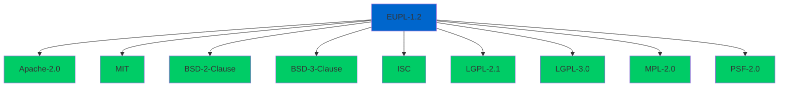

# Third-Party Dependencies

## Document Information

| Field | Value |
|-------|-------|
| Directory | third_party |
| Purpose | Third-party code and license documentation |
| Last Updated | 2026-01-16 |
| Maintainer | UCID Foundation |
| License | EUPL-1.2 |

---

## Overview

This directory documents all third-party dependencies used by the UCID library. Per Google Open Source guidelines, each dependency's license information is tracked here to ensure compliance and proper attribution.

UCID is licensed under the European Union Public License 1.2 (EUPL-1.2), which is compatible with a wide range of open-source licenses.

---

## Directory Structure

```
third_party/
├── README.md                    # This documentation file
├── LICENSES/                    # License text files
│   ├── Apache-2.0.txt          # Apache License 2.0
│   ├── MIT.txt                 # MIT License
│   ├── BSD-3-Clause.txt        # BSD 3-Clause License
│   └── PSF-2.0.txt             # Python Software Foundation License
└── licenses.json               # Machine-readable license inventory
```

---

## License Compatibility

EUPL-1.2 is compatible with the following licenses:



---

## Runtime Dependencies

### Core Dependencies

| Package | Version | License | Usage |
|---------|---------|---------|-------|
| pydantic | 2.6+ | MIT | Data validation and models |
| h3 | 3.7+ | Apache-2.0 | Hexagonal spatial indexing |
| python-dateutil | 2.8+ | Apache-2.0 | Date and time parsing |

### Optional Dependencies

| Package | Version | License | Usage |
|---------|---------|---------|-------|
| fastapi | 0.110+ | MIT | REST API framework |
| uvicorn | 0.27+ | BSD-3-Clause | ASGI server |
| numpy | 1.26+ | BSD-3-Clause | Numerical operations |
| pandas | 2.2+ | BSD-3-Clause | Data manipulation |
| geopandas | 0.14+ | BSD-3-Clause | Geospatial DataFrames |
| shapely | 2.0+ | BSD-3-Clause | Geometric operations |
| httpx | 0.27+ | BSD-3-Clause | HTTP client |

---

## Development Dependencies

| Package | Version | License | Usage |
|---------|---------|---------|-------|
| pytest | 8.0+ | MIT | Testing framework |
| pytest-cov | 4.1+ | MIT | Coverage reporting |
| mypy | 1.8+ | MIT | Static type checking |
| ruff | 0.2+ | MIT | Linting and formatting |
| pre-commit | 3.6+ | MIT | Git hooks |

---

## Dependency Details

### H3: Hexagonal Hierarchical Spatial Index

```
Package:     h3
Version:     3.7.7
License:     Apache-2.0
Homepage:    https://h3geo.org/
Repository:  https://github.com/uber/h3-py
```

H3 is a hexagonal hierarchical geospatial indexing system developed by Uber. UCID uses H3 for:

- Spatial cell generation
- Coordinate-to-cell conversion
- Cell-to-boundary operations
- Grid distance calculations

**License Notice:**

```
Copyright 2018 Uber Technologies, Inc.

Licensed under the Apache License, Version 2.0 (the "License");
you may not use this file except in compliance with the License.
You may obtain a copy of the License at

    http://www.apache.org/licenses/LICENSE-2.0
```

### Pydantic: Data Validation

```
Package:     pydantic
Version:     2.6.0
License:     MIT
Homepage:    https://pydantic.dev/
Repository:  https://github.com/pydantic/pydantic
```

Pydantic provides data validation using Python type hints. UCID uses Pydantic for:

- UCID model definition
- Input validation
- JSON serialization

**License Notice:**

```
Copyright (c) 2017-present Samuel Colvin and other contributors

Permission is hereby granted, free of charge, to any person obtaining
a copy of this software and associated documentation files...
```

### FastAPI: Web Framework

```
Package:     fastapi
Version:     0.110.0
License:     MIT
Homepage:    https://fastapi.tiangolo.com/
Repository:  https://github.com/tiangolo/fastapi
```

FastAPI is used for the optional REST API. UCID uses FastAPI for:

- API endpoint definitions
- Request/response validation
- OpenAPI documentation

---

## Data Sources

### OpenStreetMap

```
Source:      OpenStreetMap
License:     ODbL (Open Database License)
URL:         https://www.openstreetmap.org/
```

OpenStreetMap data is used for:
- Point-of-interest queries
- Amenity counting for context algorithms
- Boundary validation

**Attribution Required:**

```
Data © OpenStreetMap contributors, ODbL
```

### GTFS (General Transit Feed Specification)

```
Source:      Various transit agencies
License:     Varies by agency (typically open data)
URL:         https://gtfs.org/
```

GTFS data is used for:
- Transit context algorithm
- Transit stop counting
- Route coverage calculation

---

## License Text Files

All dependency licenses are archived in the `LICENSES/` subdirectory.

### Apache-2.0

Used by: h3, python-dateutil

Key terms:
- Permissive license
- Patent grant included
- Requires attribution
- Allows commercial use

### MIT

Used by: pydantic, fastapi, pytest, mypy, ruff

Key terms:
- Permissive license
- Minimal restrictions
- Requires copyright notice
- Allows commercial use

### BSD-3-Clause

Used by: numpy, pandas, geopandas, shapely, uvicorn

Key terms:
- Permissive license
- Three-clause version
- No endorsement clause
- Allows commercial use

---

## Compliance Checklist

| Requirement | Status |
|-------------|--------|
| License files present | Yes |
| NOTICE file updated | Yes |
| Attribution in docs | Yes |
| Compatible licenses only | Yes |
| No GPL dependencies | Yes |
| Patent grants verified | Yes |

---

## Updating Dependencies

When adding new dependencies:

1. Verify license compatibility with EUPL-1.2
2. Add entry to this README
3. Add license text to `LICENSES/` if new license type
4. Update `licenses.json`
5. Update `NOTICE` file with attribution
6. Run `python tools/check_licenses.py` to verify

---

## References

- [EUPL-1.2 Compatibility](https://joinup.ec.europa.eu/collection/eupl/matrix-eupl-compatible-open-source-licences)
- [Google Open Source License Guidelines](https://opensource.google/docs/thirdparty/)
- [SPDX License List](https://spdx.org/licenses/)
- [Choose a License](https://choosealicense.com/)

---

Copyright 2026 UCID Foundation. All rights reserved.
Licensed under EUPL-1.2.
